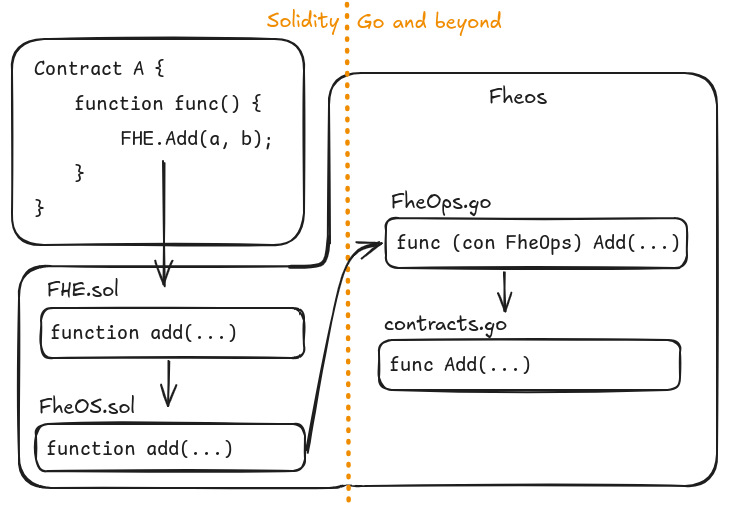

# FheOS: Fully Homomorphic Encryption on Blockchain [![Github Actions][gha-badge]][gha]

[gha]: https://github.com/fhenixprotocol/fheos/actions
[gha-badge]: https://github.com/fhenixprotocol/fheos/actions/workflows/Test.yml/badge.svg

## Overview

FheOS is designed to seamlessly integrate Fully Homomorphic Encryption (FHE) into blockchain networks, particularly those based on the Ethereum Virtual Machine (EVM). 

Our primary goal is to embed advanced FHE functionalities at the core layer of blockchains, allowing for secure, encrypted computations without having to be aware of the complexity of the underlying mathematics.

FheOS acts as a modular, easy-to-integrate layer, enhancing multiple EVM-based blockchains with the ability to execute encrypted computations. The heart of FheOS is its encrypted computation library, which includes a set of pre-compiled operations (pre-compiles) for common encrypted opcodes. These operations range from basic arithmetic, like addition and multiplication, to more complex functions such as number comparison.

Right now we support `Arbitrum Nitro` as the base EVM chain and `TFHE` as the FHE encrypted schema - but keep an eye here for future updates.

## Main Features

- **Encrypted Computation Library**: Core FHE logic with pre-compiled contract.
- **Common Arithmetic Operations**: Includes encrypted addition, multiplication, and comparison operations.
- **Automatic Solidity Library Generation**: FheOS automatically generates the library code that users need to integrate with FHE functionality
- **Modular Design**: Designed for easy integration with various EVM-based blockchains.
- **Encryption Agnostic**: Designed to be able to support multiple FHE schema **TBD** 
 
## Usage



### Prerequisites

- Node.js and (p)npm
- Go (for compiling Go-based modules)

### Installation

1. **Clone the Repository**: Clone the FheOS repository to your local machine.

2. **Install Dependencies**:

Run `make install` to install all dependencies, or choose a specific folder:

 ```bash
 # to build precompiles only
 cd precompiles && pnpm install
 # to build solidity library
 cd solgen && pnpm install
 # to test solidity code
 cd solidity && pnpm install
 ```

### Generating Code

Run `make gen` will generate both the chain code and the solidity library.

generation order


#### Arbitrum

If you just want to generate the chain code, you can do it with the `gen.sh` script. This script generates two important files: `chains/arbitrum/contractsgen/contractsgen.go` as well as `FheOps.go` - these contain the logic required to hook into Arbitrum nitro.
Note that `FheOps.go` will only be generated if you use `./gen.sh -g true`. The original purpose of this script was to be executed from outside the FheOS repo, so by default it will generate `FheOps.go` in Nitro's precompiles folder.

If you want to set a different path (e.g. for local testing), you can do so with the flag `-d <path>`. Using `-n true` will set the path to `./nitro-overrides/precompiles` which is the default for standalone testing.

#### Solidity Library

To generate solidity code use `cd solgen && pnpm build`. This will generate `FHE.sol` and `FheOS.sol` in the `./solidity` folder.

### Testing with LocalFhenix

To run a test with a standalone nitro node, use the included `Dockerfile` (or `Dockerfile.debug` for that variant) - this removes the complexity of having to be familiar with the entire base chain build process.

```bash
docker build -f Dockerfile -t temp .
docker run -it -p 8547:8547 temp
```

Then from another terminal

```bash
# or just run tests manually from the IDE
make test
```
